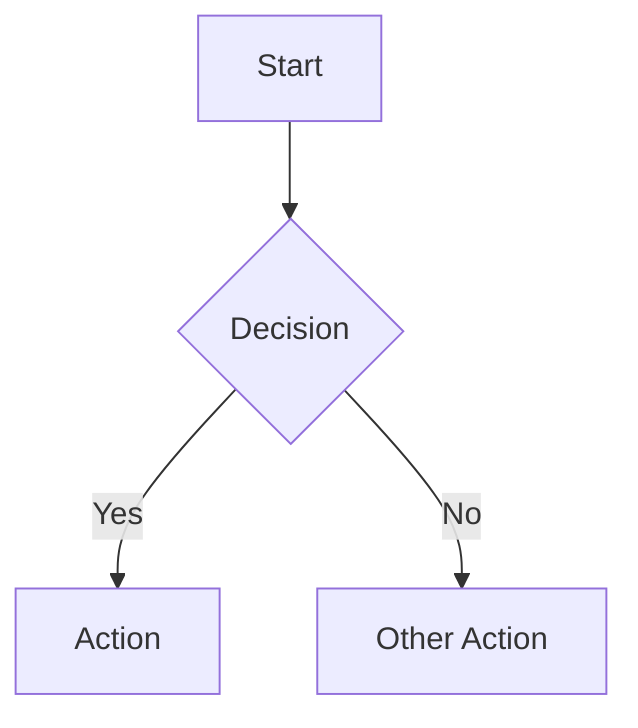

Create or update Mermaid diagram for $ARGUMENTS:

## Auto-Invocation Triggers

This skill is automatically invoked when:
- **Planner creates design.md** - Generate architecture diagram showing components and data flows
- **New agent/component added** - Update component diagram to include new elements
- **Workflow changes** - Update workflow diagram to reflect new process steps

## Step 1: Understand Context

Before creating a diagram:
- Read relevant source files to understand the feature/component
- Identify components, relationships, and data flows
- Check existing diagrams in `docs/diagrams/` for consistency
- Review design.md for architectural decisions

## Step 2: Select Diagram Type

Choose the appropriate diagram type based on what needs to be visualized:

| Type | Use For | Example |
|------|---------|---------|
| `flowchart` | Workflows, processes, decision trees | Build pipelines, approval flows |
| `sequenceDiagram` | Interactions, API flows, request/response | Agent communication, HITL gates |
| `classDiagram` | Component relationships, interfaces | Service dependencies, module structure |
| `stateDiagram` | State machines, lifecycle | Task states, session lifecycle |

## Step 3: Generate Diagram

Follow existing conventions from `docs/diagrams/`:

- Use theme initialization for consistent styling:
```mermaid
%%{init: {'theme': 'base', 'themeVariables': { 'primaryColor': '#E6F0FF', 'primaryTextColor': '#1e3a5f', 'primaryBorderColor': '#2563eb', 'lineColor': '#64748b'}}}%%
```

- Use subgraphs to group related components
- Add class definitions for consistent styling
- Include descriptive labels on connections
- Add legend if diagram is complex

## Step 4: Save Diagram

Write the diagram to the standard location:

```bash
# Primary location
docs/diagrams/{name}.mmd
```

**Naming conventions:**
- Use kebab-case: `agent-communication.mmd`, `tdd-workflow.mmd`
- Prefix with number for ordered sets: `01-overview.mmd`, `02-detail.mmd`
- Name should describe content, not location

## Step 5: Copy to UI (if applicable)

If the diagram should be visible in the HITL UI:

```bash
# Copy to HITL UI public assets
cp docs/diagrams/{name}.mmd docker/hitl-ui/public/docs/diagrams/
```

Diagrams that should be copied to UI:
- Architecture overviews
- Workflow diagrams users need to reference
- HITL gate decision flows

## Step 6: Update References

After creating/updating a diagram:
- Update `design.md` to reference the diagram with relative path
- Update `README.md` if diagram is public-facing documentation
- Add to any relevant documentation that should include the visualization

## Diagram Conventions

Standard file header format:



### Styling Classes

Use consistent class definitions:

```mermaid
classDef ui fill:#E0F2FE,stroke:#0284c7,stroke-width:2px
classDef orchestration fill:#D0E8FF,stroke:#2563eb,stroke-width:2px
classDef eventbus fill:#FEE2E2,stroke:#dc2626,stroke-width:2px
classDef agent fill:#E6F0FF,stroke:#2563eb,stroke-width:2px
classDef infra fill:#F3E8FF,stroke:#9333ea,stroke-width:2px
```

## Invokers

| Agent | Invocation Type | Purpose |
|-------|-----------------|---------|
| Planner | Auto | Architecture diagrams during planning phase |
| Orchestrator | Explicit | Documentation updates, workflow diagrams |

## Output Paths

| Path | Purpose |
|------|---------|
| `docs/diagrams/` | Primary diagram storage (Git-tracked) |
| `docker/hitl-ui/public/docs/diagrams/` | HITL UI visible diagrams |
